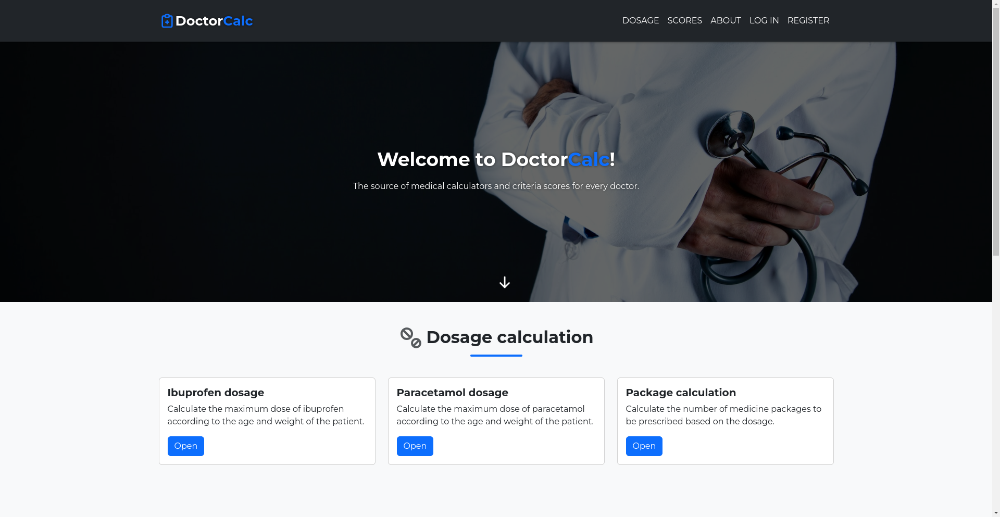
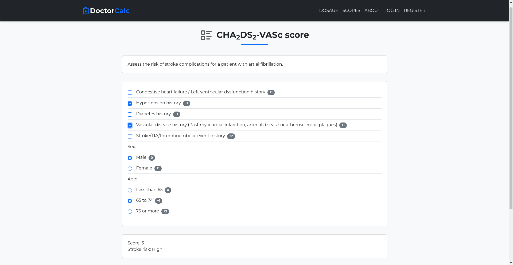
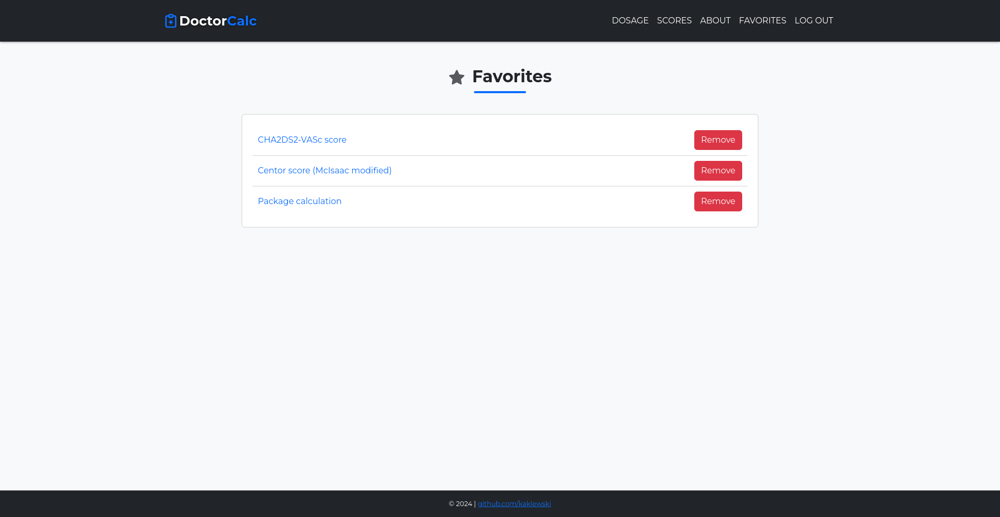

# DoctorCalc

## About

DoctorCalc is the final project I made for the CS50x course. It is a demo of a web app featuring medical calculators and
criteria tests/scores, designed primarily for doctors. In its
current form, it contains three calculators and three medical
scores, along with a login and registration system. Registration allows users to add items to their favorites.

The front end is created with:

-   HTML
-   SCSS
-   Bootstrap
-   Vanilla JavaScript

The back end is created with:

-   Python
-   Flask
-   SQLite

## Features

-   **Medical calculators**: Calculate medication dosages or packaging needs with specialized calculators.
-   **Doctor scales**: Determine patient scores using a variety of medical scales.
-   **Recommendations**: Receive personalized recommendations based on calculated scores.
-   **Favorites**: Register to save and easily access your favorite calculators and scales.

## Screenshots

## Run Locally

1. Clone the project to your local machine:

`git clone https://github.com/kaklewski/doctor-calc`

2. Navigate to the project directory:

`cd doctor-calc`

3. Create a Python virtual environment:

`virtualenv venv`

4. Activate the environment:

`source venv/bin/activate`

5. Install the dependencies:

`pip install -r requirements.txt`

6. Start the development environment:

`flask --app app.py --debug run`
